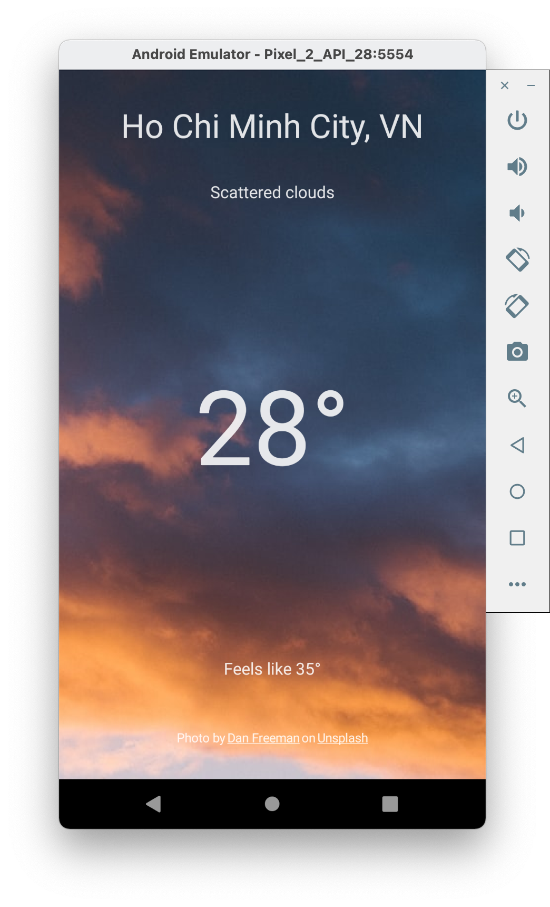
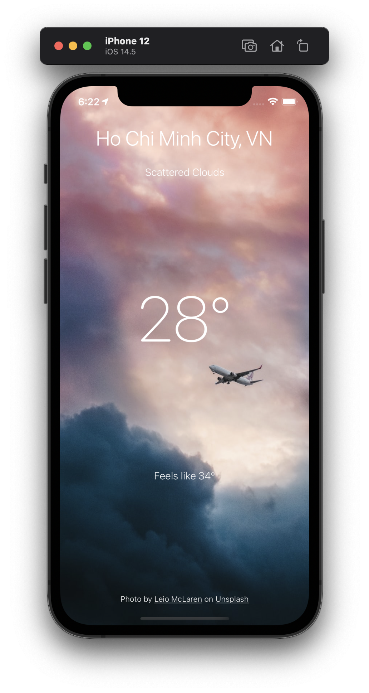

# Weather Forecast

This sample project is used to support the Kotlin Multiplatform article: [Build iOS apps using the Kotlin Multiplatform framework](https://pixelcarrot.com/build-ios-apps-using-the-kotlin-multiplatform-framework)


<table>
    <tr>
        <td align="center"><b>Android</b></td>
        <td align="center"><b>iOS</b></td>
    </tr>
    <tr>
        <td></td>
        <td></td>
    </tr>
</table>


## Active Remote Data

To active remote requests, please register API keys from OpenWeather and Unsplash. Then disable mock in Constant object. Here I have prepared a test key for you to see the results of the app, but it comes with a limitation in the number of requests.

`shared/src/commonMain/kotlin/com/pixelcarrot/weatherforecast/Constant.kt `

```kotlin
internal object Constant {
    const val IS_MOCK_ENABLED = false
    const val OPEN_WEATHER_MAP_API_KEY: String = "b88b0f96f0bb9f3df02b8171604108d9"
    const val UNSPLASH_CLIENT_ID: String = "y60oF_N-WYDTTD_KJM_L_ZxinbsFP9OyK-magLVDsz0"
}
```

## Author

Justin Nguyen, nguyen.cocoa@gmail.com

## License

Weather Forecast is available under the MIT license. See the LICENSE file for more info.
